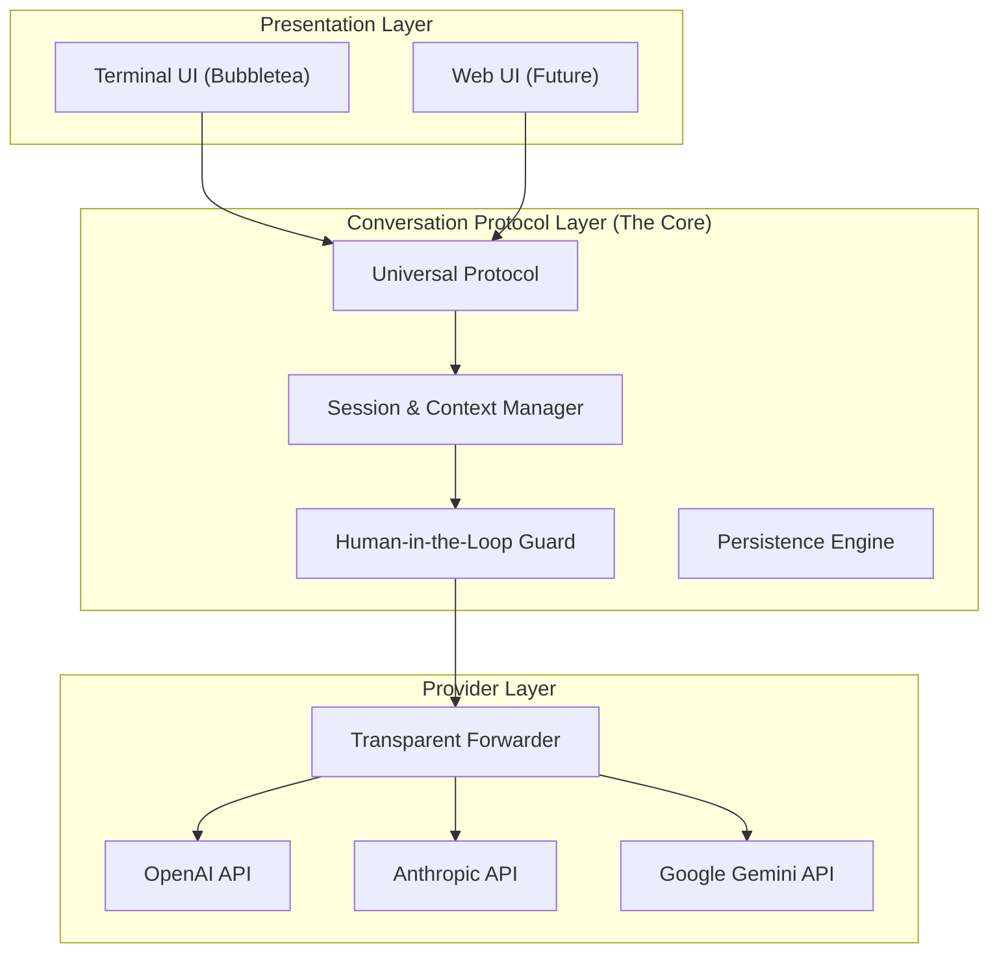

# Zotigo

Zotigo is a next-generation, protocol-centric CLI Agent written in Golang. It is designed to be a universal interface for AI interaction, capable of switching seamlessly between multiple LLM providers while maintaining a unified conversation context.

Positioned as a competitor to tools like Claude Code, Gemini CLI, and Codex CLI, Zotigo distinguishes itself through a rigorous decoupled architecture that separates the **Presentation Layer**, **Conversation Protocol Layer**, and **Provider Layer**.

## Key Philosophy

- **Protocol First:** All interactions are normalized into a standard internal protocol before processing. Switching models doesn't break context or tools.
- **Transparent Forwarding:** The provider layer acts as a transparent adapter, forwarding the normalized protocol to specific model APIs without leaking implementation details to the core.
- **Human-in-the-Loop:** Deeply integrated approval mechanisms for sensitive actions (file edits, shell execution), with auto-approve for read-only tools.
- **Persistence:** Every interaction is structured and persistable, allowing for long-running sessions and history resumption.

## Architecture

Zotigo follows a strict three-layer architecture:



### 1. Presentation Layer (Top)
Rich **TUI (Terminal User Interface)** with streaming responses, tool call visualization, and an approval flow (accept / deny / feedback). Purely a view layer with no business logic.

### 2. Conversation Protocol Layer (Middle)
The brain of Zotigo:
- **Protocol Conversion:** Standardized internal message format.
- **Context Management:** Sliding-window history with intelligent compression.
- **Tool Orchestration:** Safety-aware tool dispatch with auto-approve for read-only operations.
- **Skill System:** Auto-enabled skills that inject domain-specific instructions into the system prompt, dynamically reloaded from disk.
- **Persistence:** Session state saved to `.zotigo/sessions/`.

### 3. Provider Layer (Bottom)
Thin, transparent layer translating the Zotigo Protocol into vendor-specific API calls, supporting native capabilities of each model.

## Features

- **Multi-Provider Support:** OpenAI, Anthropic, and Google Gemini — switch models on the fly.
- **Built-in Tools:** file, edit/patch, shell, grep/glob, git, LSP, web search (Tavily), web fetch.
- **Skill System:** Extensible skills (builtin, user, project) auto-injected into the prompt — no manual activation needed. Use `/skills` to list, `/<skill-name>` to invoke.
- **Safe Execution:** Tool safety policy with auto-approve for read-only tools, manual approval for mutations. Toggle auto-approve with `Shift+Tab`.
- **Context Awareness:** Project files, git history, loop detection, and automatic context compression.
- **Session Persistence:** Resume conversations across restarts.

## Directory Structure

```
zotigo/
├── cli/                       # TUI and slash-command layer
│   ├── commands/              # Command registry and builtins
│   └── tui/                   # Bubbletea TUI model
├── core/
│   ├── agent/                 # Conversation + tool-calling loop
│   │   └── prompt/            # System/user prompt builder
│   ├── config/                # Config loading/merge
│   ├── providers/             # OpenAI / Anthropic / Gemini adapters
│   ├── sandbox/               # Execution safety policy
│   ├── services/              # Loop detection / compression / tokenizer
│   ├── session/               # Session persistence and locking
│   ├── skills/                # Skill discovery, loading, and injection
│   ├── tools/                 # Built-in tools
│   ├── lsp/                   # Language server integration
│   └── transport/             # Runner transport abstraction
├── e2e.config.example.json    # Example config for provider E2E tests
└── E2E_TESTING.md             # E2E test configuration guide
```

## Installation

```bash
go install github.com/jayyao97/zotigo@latest
```

## Configuration

On first run (`go run ./cli`), Zotigo creates the default config at `~/.zotigo/config.json` if it does not exist.

```json
{
  "default_profile": "gpt-4o",
  "profiles": {
    "gpt-4o": {
      "provider": "openai",
      "model": "gpt-4o",
      "api_key": "sk-..."
    },
    "claude-sonnet": {
      "provider": "anthropic",
      "model": "claude-sonnet-4-20250514",
      "api_key": "sk-ant-..."
    },
    "gemini": {
      "provider": "gemini",
      "model": "gemini-2.5-flash",
      "api_key": "..."
    }
  }
}
```

Run:
```bash
go run ./cli
```

Note:
- `go run .` executes the root placeholder `main.go` used for bootstrap/testing.
- The interactive CLI entrypoint is `./cli/main.go`.
