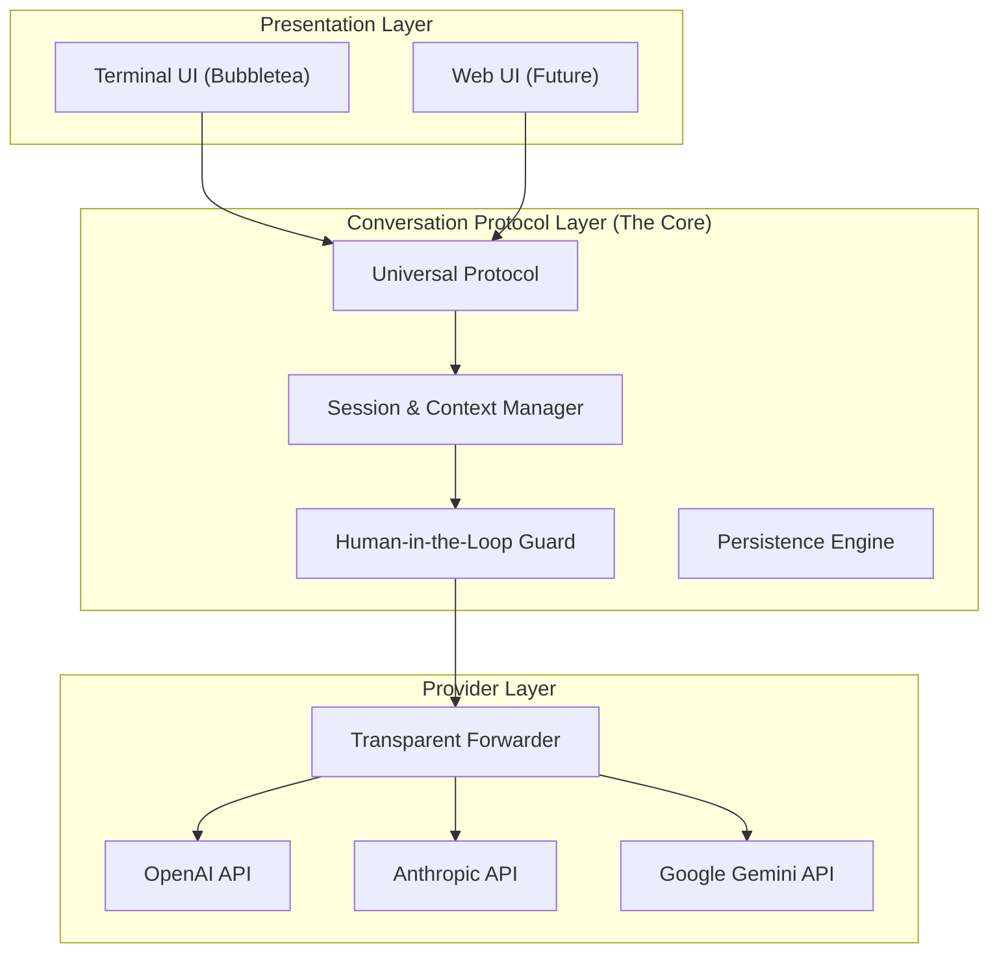

# Zotigo

Zotigo is a next-generation, protocol-centric CLI Agent written in Golang. It is designed to be a universal interface for AI interaction, capable of switching seamlessly between multiple LLM providers while maintaining a unified conversation context.

Positioned as a competitor to tools like Claude Code, Gemini CLI, and Codex CLI, Zotigo distinguishes itself through a rigorous decoupled architecture that separates the **Presentation Layer**, **Conversation Protocol Layer**, and **Provider Layer**.

## 🌟 Key Philosophy

- **Protocol First:** All interactions are normalized into a standard internal protocol (inspired by Vercel AI SDK and Pydantic AI patterns) before processing. This ensures that switching models doesn't break context or tools.
- **Transparent Forwarding:** The provider layer acts as a transparent adapter, forwarding the normalized protocol to specific model APIs without leaking implementation details to the core.
- **Human-in-the-Loop:** Deeply integrated approval mechanisms for sensitive actions (file edits, shell execution).
- **Persistence:** Every interaction is structured and persistable, allowing for long-running sessions and history resumption.

## 🏗️ Architecture

Zotigo follows a strict three-layer architecture to ensure generalizability and ease of iteration:



### 1. Presentation Layer (Top)
Currently focused on a rich **TUI (Terminal User Interface)**. It handles user input, renders streaming responses, and visualizes artifacts (diffs, markdown). It is purely a view layer; it contains no business logic.

### 2. Conversation Protocol Layer (Middle)
This is the brain of Zotigo. It handles:
- **Protocol Conversion:** Converting user intent into a standardized internal message format.
- **Context Management:** managing the sliding window of conversation history.
- **Tool Orchestration:** Deciding when to call tools (though the execution might happen via the provider's reasoning).
- **Persistence:** Saving state to disk (`.zotigo/sessions/`).

### 3. Provider Layer (Bottom)
A thin, transparent layer that translates the Zotigo Protocol into vendor-specific API calls. It aims to support the native capabilities of each model (e.g., using OpenAI's function calling format vs. Claude's tool use xml/json).

## 🚀 Features

- **Multi-Provider Support:** Switch models on the fly.
- **SWE & General Mode:** Specialized prompts and toolsets for Software Engineering vs. General Chat.
- **Safe Execution:** Sandboxed environment for tool execution with user permission checks.
- **Context Awareness:** Smart handling of project files and git history.

## 📊 Current Status (2026-02-06)

Implemented:
- Core agent loop with tool-calling + approval flow.
- Session persistence and resume support.
- Built-in tools: file, edit/patch, shell, grep/glob, git, lsp.
- Providers: OpenAI Chat Completions, Anthropic Messages.
- Safety and quality services: sandbox guard, loop detector, context compressor.

In progress / pending:
- Gemini provider.
- E2B / Docker environments.
- MCP and hooks systems.
- Slash command framework integration into the current TUI input path.

## 🛠️ Development Roadmap

See `task.json` for the detailed breakdown of the implementation plan.

### Directory Structure

``` 
zotigo/
├── cli/                    # TUI and slash-command layer
├── core/
│   ├── agent/              # Conversation + tool-calling loop
│   ├── config/             # Config loading/merge
│   ├── providers/          # OpenAI / Anthropic adapters
│   ├── sandbox/            # Execution safety policy
│   ├── services/           # Loop detection / compression / tokenizer
│   ├── session/            # Session persistence and locking
│   ├── tools/              # Built-in tools
│   ├── lsp/                # Language server integration
│   └── transport/          # Runner transport abstraction
├── e2e.config.example.json # Example config for provider E2E tests
└── zotigo_plan.md          # Planning and phase status notes
```

## 📦 Installation

```bash
go install github.com/jayyao97/zotigo@latest
```

## 🔧 Configuration

On first run (`go run ./cli`), Zotigo will create the default config template at `~/.zotigo/config.yaml` if it does not exist.

```yaml
# ~/.zotigo/config.yaml
default_profile: "gpt-4o"
profiles:
  gpt-4o:
    provider: "openai"
    model: "gpt-4o"
    api_key: "sk-..."
  claude-sonnet:
    provider: "anthropic"
    model: "claude-3-5-sonnet-latest"
    api_key: "sk-ant-..."
```

Run:
```bash
go run ./cli
```

Note:
- `go run .` executes the root placeholder `main.go` used for bootstrap/testing.
- The interactive CLI entrypoint is `./cli/main.go`.
